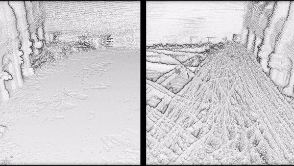
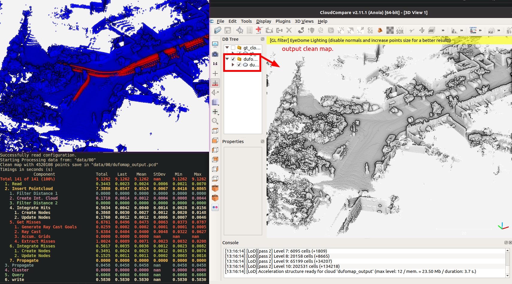

<br />
<p align="center">
  <h2 align="center">DUFOMap: Efficient Dynamic Awareness Mapping</h1>
  <p align="center">
    <strong>Daniel Duberg</strong><sup>1,*</sup>&nbsp;&nbsp;&nbsp;
    <strong>Qingwen Zhang</strong><sup>1,*</sup>&nbsp;&nbsp;&nbsp;
    <strong>Mingkai Jia</strong><sup>2</sup>&nbsp;&nbsp;&nbsp;
    <strong>Patric Jensfelt</strong><sup>1</sup>&nbsp;&nbsp;&nbsp;
    <br />
    <sup>*</sup><strong>Co-first author</strong>,&nbsp;&nbsp;&nbsp; <strong>KTH</strong><sup>1</sup>&nbsp;&nbsp;&nbsp; <strong>HKUST</strong><sup>2</sup>&nbsp;&nbsp;&nbsp;
  </p>
</p>

[](https://arxiv.org/abs/2403.01449)
[](https://KTH-RPL.github.io/dufomap) [video coming soon] [poster coming soon]

Quick Demo: Run with the **same parameter setting** without tuning for different sensor (e.g 16, 32, 64, and 128 channel LiDAR and Livox-series mid360), the following shows the data collected from: Leica-RTC360, 128-channel LiDAR and Livox-mid360 effect.

|  |  |  |
| ------- | ------- | ------- |

## 0. Setup


### Environment

Since Ranges (`std::range`) and `#include <concepts>` first existed in C++20 and GCC 10

```bash
sudo add-apt-repository ppa:ubuntu-toolchain-r/test
sudo apt update && apt install gcc-10 g++-10
sudo apt install libtbb-dev liblz4-dev
```
Dockerfile will be soon available.

## 1. Build & Run

Build:

```bash
cmake -B build -D CMAKE_CXX_COMPILER=g++-10 && cmake --build build
```

Prepare Data:

Teaser data (KITTI 00: 384.4Mb), more data detail can be found in the [Dataset Section](https://github.com/KTH-RPL/DynamicMap_Benchmark?tab=readme-ov-file#dataset--scripts).

```bash
wget https://zenodo.org/records/8160051/files/00.zip
unzip 00.zip -d data
```

Run:

```bash
./build/dufomap data/00
```



## 2. Evaluation

Please reference to [DynamicMap_Benchmark](https://github.com/KTH-RPL/DynamicMap_Benchmark) for the evaluation of DUFOMap and comparison with other dynamic removal  methods.

[Evaluation Section link](https://github.com/KTH-RPL/DynamicMap_Benchmark/blob/master/scripts/README.md#evaluation)


## Acknowledgements

Thanks to HKUST Ramlab's members: Bowen Yang, Lu Gan, Mingkai Tang, and Yingbing Chen, who help collect additional datasets. 

This work was partially supported by the Wallenberg AI, Autonomous Systems and Software Program ([WASP](https://wasp-sweden.org/)) funded by the Knut and Alice Wallenberg Foundation

The original DUFOMap code is from the fork repo: [https://github.com/UnknownFreeOccupied/ufomap/tree/dufomap](https://github.com/UnknownFreeOccupied/ufomap/tree/dufomap) as it based on ufomap structure. Feel free to explore link projects use ufomap (code links as follows):
- [RA-L'24 DUFOMap, Dynamic Awareness]()
- [RA-L'23 SLICT, SLAM](https://github.com/brytsknguyen/slict)
- [RA-L'20 UFOMap, map framework](https://github.com/UnknownFreeOccupied/ufomap)

### Cite Our Paper

Please cite our work if you find these useful for your research.

DUFOMap:
```
@article{daniel2024dufomap,
    author    = {Daniel, Duberg and Zhang, Qingwen and Jia, Mingkai and Jensfelt, Patric},
    title     = {DUFOMap: Efficient Dynamic Awareness Mapping},
    journal   = {arXiv preprint arXiv:2403.01449},
    year      = {2024},
}
```

Benchmark:
```
@inproceedings{zhang2023benchmark,
  author={Zhang, Qingwen and Duberg, Daniel and Geng, Ruoyu and Jia, Mingkai and Wang, Lujia and Jensfelt, Patric},
  booktitle={IEEE 26th International Conference on Intelligent Transportation Systems (ITSC)}, 
  title={A Dynamic Points Removal Benchmark in Point Cloud Maps}, 
  year={2023},
  pages={608-614},
  doi={10.1109/ITSC57777.2023.10422094}
}
```